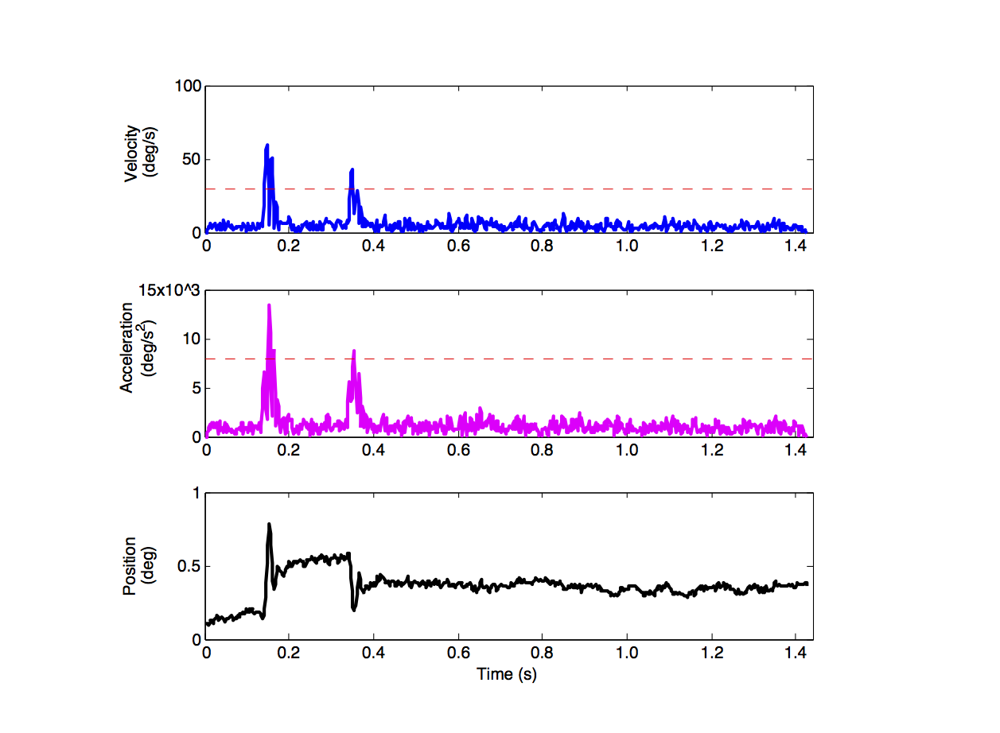

# neurosci-saccade-detection
Example Matlab code for extracting useful eye position information from gaze 
coordinate data.

## About
The repository contains a Matlab script for preprocessing raw gaze coordinate 
data and detecting instances of small eye movements or **saccades** in the time
series. This procedure is often carried out in order to remove from analysis trials 
in which an observer was not attending to a given experimental task; the same
routine can be modified to study how task or stimulus parameters effect
gaze position or eye movement dynamics.

The raw gaze coordinate data (500Hz) is loaded from an associated .mat file, and 
contains gaze position data from 120 separate trials of a behavioral task. During the 
task, the observer was instructed to maintain a fixed eye position; large deviations 
from stable fixation are notable on certain trials - the positional information and 
velocity/acceleration profiles change abruptly.

An example saccade trial is illustrated below (velocity/acceleration thresholds are 
indicated by the dashed red lines).

